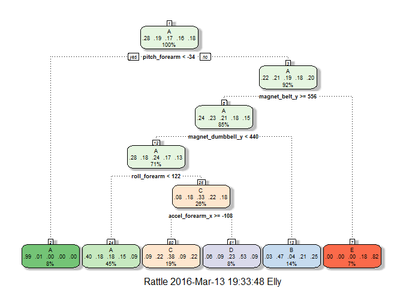

# Practical Machine Learning Assignment
### SYNOPSIS:

One thing that people regularly do is quantify how much of a particular activity they do, but they rarely quantify how well they do it. In this project, my goal is to predict the manner in which the participants in a series of excercises did the exercise(this is the "classe" variable in the training set). I use data from accelerometers on the belt, forearm, arm, and dumbell of 6 participants to predict with.The data for this project come from this source: http://groupware.les.inf.puc-rio.br/har. I try different models and use cross validation to test the models and based on accuracy and out of sample error rates of the models I choose the best prediction model to apply on testing set and predict 20 different test cases.

In the begining I am going to load all the required packages as well as preparing R environment.

```r
library(knitr)
library(caret)
```

```
## Loading required package: lattice
```

```
## Loading required package: ggplot2
```

```r
opts_chunk$set(echo=TRUE,cache=TRUE)
setwd("d:\\datascience\\practicalmachinelearning\\Assignment")
```

### Loading training data into R

In this stage I am just going to download and read training data,and leave the testing data for last stage when I want to get the final results out of my most accurate model.

```r
download.file("https://d396qusza40orc.cloudfront.net/predmachlearn/pml-training.csv",destfile = "pml_training.csv")
pml_training<-read.csv("pml_training.csv",na.strings = c("","NA"))
str(pml_training,list.len = 20)
```

```
## 'data.frame':	19622 obs. of  160 variables:
##  $ X                       : int  1 2 3 4 5 6 7 8 9 10 ...
##  $ user_name               : Factor w/ 6 levels "adelmo","carlitos",..: 2 2 2 2 2 2 2 2 2 2 ...
##  $ raw_timestamp_part_1    : int  1323084231 1323084231 1323084231 1323084232 1323084232 1323084232 1323084232 1323084232 1323084232 1323084232 ...
##  $ raw_timestamp_part_2    : int  788290 808298 820366 120339 196328 304277 368296 440390 484323 484434 ...
##  $ cvtd_timestamp          : Factor w/ 20 levels "02/12/2011 13:32",..: 9 9 9 9 9 9 9 9 9 9 ...
##  $ new_window              : Factor w/ 2 levels "no","yes": 1 1 1 1 1 1 1 1 1 1 ...
##  $ num_window              : int  11 11 11 12 12 12 12 12 12 12 ...
##  $ roll_belt               : num  1.41 1.41 1.42 1.48 1.48 1.45 1.42 1.42 1.43 1.45 ...
##  $ pitch_belt              : num  8.07 8.07 8.07 8.05 8.07 8.06 8.09 8.13 8.16 8.17 ...
##  $ yaw_belt                : num  -94.4 -94.4 -94.4 -94.4 -94.4 -94.4 -94.4 -94.4 -94.4 -94.4 ...
##  $ total_accel_belt        : int  3 3 3 3 3 3 3 3 3 3 ...
##  $ kurtosis_roll_belt      : Factor w/ 396 levels "-0.016850","-0.021024",..: NA NA NA NA NA NA NA NA NA NA ...
##  $ kurtosis_picth_belt     : Factor w/ 316 levels "-0.021887","-0.060755",..: NA NA NA NA NA NA NA NA NA NA ...
##  $ kurtosis_yaw_belt       : Factor w/ 1 level "#DIV/0!": NA NA NA NA NA NA NA NA NA NA ...
##  $ skewness_roll_belt      : Factor w/ 394 levels "-0.003095","-0.010002",..: NA NA NA NA NA NA NA NA NA NA ...
##  $ skewness_roll_belt.1    : Factor w/ 337 levels "-0.005928","-0.005960",..: NA NA NA NA NA NA NA NA NA NA ...
##  $ skewness_yaw_belt       : Factor w/ 1 level "#DIV/0!": NA NA NA NA NA NA NA NA NA NA ...
##  $ max_roll_belt           : num  NA NA NA NA NA NA NA NA NA NA ...
##  $ max_picth_belt          : int  NA NA NA NA NA NA NA NA NA NA ...
##  $ max_yaw_belt            : Factor w/ 67 levels "-0.1","-0.2",..: NA NA NA NA NA NA NA NA NA NA ...
##   [list output truncated]
```

##preprocessing data

As we can see from above table,there are 160 variables and many of them are  unnecessary for prediction such as cuolumns with many NAs or high correlation variable.Therefore I will clean the data in different steps.
First I want to know how many columns are complete and without any NA.First I figure out the number of NAs in columns and then remove the columns with mostly NAs.


```r
num_NA_per_col<-colSums(is.na(pml_training))
num_NA_per_col
```

```
##                        X                user_name     raw_timestamp_part_1 
##                        0                        0                        0 
##     raw_timestamp_part_2           cvtd_timestamp               new_window 
##                        0                        0                        0 
##               num_window                roll_belt               pitch_belt 
##                        0                        0                        0 
##                 yaw_belt         total_accel_belt       kurtosis_roll_belt 
##                        0                        0                    19216 
##      kurtosis_picth_belt        kurtosis_yaw_belt       skewness_roll_belt 
##                    19216                    19216                    19216 
##     skewness_roll_belt.1        skewness_yaw_belt            max_roll_belt 
##                    19216                    19216                    19216 
##           max_picth_belt             max_yaw_belt            min_roll_belt 
##                    19216                    19216                    19216 
##           min_pitch_belt             min_yaw_belt      amplitude_roll_belt 
##                    19216                    19216                    19216 
##     amplitude_pitch_belt       amplitude_yaw_belt     var_total_accel_belt 
##                    19216                    19216                    19216 
##            avg_roll_belt         stddev_roll_belt            var_roll_belt 
##                    19216                    19216                    19216 
##           avg_pitch_belt        stddev_pitch_belt           var_pitch_belt 
##                    19216                    19216                    19216 
##             avg_yaw_belt          stddev_yaw_belt             var_yaw_belt 
##                    19216                    19216                    19216 
##             gyros_belt_x             gyros_belt_y             gyros_belt_z 
##                        0                        0                        0 
##             accel_belt_x             accel_belt_y             accel_belt_z 
##                        0                        0                        0 
##            magnet_belt_x            magnet_belt_y            magnet_belt_z 
##                        0                        0                        0 
##                 roll_arm                pitch_arm                  yaw_arm 
##                        0                        0                        0 
##          total_accel_arm            var_accel_arm             avg_roll_arm 
##                        0                    19216                    19216 
##          stddev_roll_arm             var_roll_arm            avg_pitch_arm 
##                    19216                    19216                    19216 
##         stddev_pitch_arm            var_pitch_arm              avg_yaw_arm 
##                    19216                    19216                    19216 
##           stddev_yaw_arm              var_yaw_arm              gyros_arm_x 
##                    19216                    19216                        0 
##              gyros_arm_y              gyros_arm_z              accel_arm_x 
##                        0                        0                        0 
##              accel_arm_y              accel_arm_z             magnet_arm_x 
##                        0                        0                        0 
##             magnet_arm_y             magnet_arm_z        kurtosis_roll_arm 
##                        0                        0                    19216 
##       kurtosis_picth_arm         kurtosis_yaw_arm        skewness_roll_arm 
##                    19216                    19216                    19216 
##       skewness_pitch_arm         skewness_yaw_arm             max_roll_arm 
##                    19216                    19216                    19216 
##            max_picth_arm              max_yaw_arm             min_roll_arm 
##                    19216                    19216                    19216 
##            min_pitch_arm              min_yaw_arm       amplitude_roll_arm 
##                    19216                    19216                    19216 
##      amplitude_pitch_arm        amplitude_yaw_arm            roll_dumbbell 
##                    19216                    19216                        0 
##           pitch_dumbbell             yaw_dumbbell   kurtosis_roll_dumbbell 
##                        0                        0                    19216 
##  kurtosis_picth_dumbbell    kurtosis_yaw_dumbbell   skewness_roll_dumbbell 
##                    19216                    19216                    19216 
##  skewness_pitch_dumbbell    skewness_yaw_dumbbell        max_roll_dumbbell 
##                    19216                    19216                    19216 
##       max_picth_dumbbell         max_yaw_dumbbell        min_roll_dumbbell 
##                    19216                    19216                    19216 
##       min_pitch_dumbbell         min_yaw_dumbbell  amplitude_roll_dumbbell 
##                    19216                    19216                    19216 
## amplitude_pitch_dumbbell   amplitude_yaw_dumbbell     total_accel_dumbbell 
##                    19216                    19216                        0 
##       var_accel_dumbbell        avg_roll_dumbbell     stddev_roll_dumbbell 
##                    19216                    19216                    19216 
##        var_roll_dumbbell       avg_pitch_dumbbell    stddev_pitch_dumbbell 
##                    19216                    19216                    19216 
##       var_pitch_dumbbell         avg_yaw_dumbbell      stddev_yaw_dumbbell 
##                    19216                    19216                    19216 
##         var_yaw_dumbbell         gyros_dumbbell_x         gyros_dumbbell_y 
##                    19216                        0                        0 
##         gyros_dumbbell_z         accel_dumbbell_x         accel_dumbbell_y 
##                        0                        0                        0 
##         accel_dumbbell_z        magnet_dumbbell_x        magnet_dumbbell_y 
##                        0                        0                        0 
##        magnet_dumbbell_z             roll_forearm            pitch_forearm 
##                        0                        0                        0 
##              yaw_forearm    kurtosis_roll_forearm   kurtosis_picth_forearm 
##                        0                    19216                    19216 
##     kurtosis_yaw_forearm    skewness_roll_forearm   skewness_pitch_forearm 
##                    19216                    19216                    19216 
##     skewness_yaw_forearm         max_roll_forearm        max_picth_forearm 
##                    19216                    19216                    19216 
##          max_yaw_forearm         min_roll_forearm        min_pitch_forearm 
##                    19216                    19216                    19216 
##          min_yaw_forearm   amplitude_roll_forearm  amplitude_pitch_forearm 
##                    19216                    19216                    19216 
##    amplitude_yaw_forearm      total_accel_forearm        var_accel_forearm 
##                    19216                        0                    19216 
##         avg_roll_forearm      stddev_roll_forearm         var_roll_forearm 
##                    19216                    19216                    19216 
##        avg_pitch_forearm     stddev_pitch_forearm        var_pitch_forearm 
##                    19216                    19216                    19216 
##          avg_yaw_forearm       stddev_yaw_forearm          var_yaw_forearm 
##                    19216                    19216                    19216 
##          gyros_forearm_x          gyros_forearm_y          gyros_forearm_z 
##                        0                        0                        0 
##          accel_forearm_x          accel_forearm_y          accel_forearm_z 
##                        0                        0                        0 
##         magnet_forearm_x         magnet_forearm_y         magnet_forearm_z 
##                        0                        0                        0 
##                   classe 
##                        0
```

```r
sum_col_with_NA<-sum(colSums(is.na(pml_training))!=0)
sum_col_with_NA
```

```
## [1] 100
```

I can see from information above that columns either have 0 NA or 19216 NAs,and altogether there are 100 columns with mostly NA values.Therefore, I easily remove all the columns with  NA values.


```r
pml_training1<-pml_training[,colSums(is.na(pml_training))==0]
dim(pml_training1)
```

```
## [1] 19622    60
```

```r
head(pml_training1,n=4)
```

```
##   X user_name raw_timestamp_part_1 raw_timestamp_part_2   cvtd_timestamp
## 1 1  carlitos           1323084231               788290 05/12/2011 11:23
## 2 2  carlitos           1323084231               808298 05/12/2011 11:23
## 3 3  carlitos           1323084231               820366 05/12/2011 11:23
## 4 4  carlitos           1323084232               120339 05/12/2011 11:23
##   new_window num_window roll_belt pitch_belt yaw_belt total_accel_belt
## 1         no         11      1.41       8.07    -94.4                3
## 2         no         11      1.41       8.07    -94.4                3
## 3         no         11      1.42       8.07    -94.4                3
## 4         no         12      1.48       8.05    -94.4                3
##   gyros_belt_x gyros_belt_y gyros_belt_z accel_belt_x accel_belt_y
## 1         0.00            0        -0.02          -21            4
## 2         0.02            0        -0.02          -22            4
## 3         0.00            0        -0.02          -20            5
## 4         0.02            0        -0.03          -22            3
##   accel_belt_z magnet_belt_x magnet_belt_y magnet_belt_z roll_arm
## 1           22            -3           599          -313     -128
## 2           22            -7           608          -311     -128
## 3           23            -2           600          -305     -128
## 4           21            -6           604          -310     -128
##   pitch_arm yaw_arm total_accel_arm gyros_arm_x gyros_arm_y gyros_arm_z
## 1      22.5    -161              34        0.00        0.00       -0.02
## 2      22.5    -161              34        0.02       -0.02       -0.02
## 3      22.5    -161              34        0.02       -0.02       -0.02
## 4      22.1    -161              34        0.02       -0.03        0.02
##   accel_arm_x accel_arm_y accel_arm_z magnet_arm_x magnet_arm_y
## 1        -288         109        -123         -368          337
## 2        -290         110        -125         -369          337
## 3        -289         110        -126         -368          344
## 4        -289         111        -123         -372          344
##   magnet_arm_z roll_dumbbell pitch_dumbbell yaw_dumbbell
## 1          516      13.05217      -70.49400    -84.87394
## 2          513      13.13074      -70.63751    -84.71065
## 3          513      12.85075      -70.27812    -85.14078
## 4          512      13.43120      -70.39379    -84.87363
##   total_accel_dumbbell gyros_dumbbell_x gyros_dumbbell_y gyros_dumbbell_z
## 1                   37                0            -0.02             0.00
## 2                   37                0            -0.02             0.00
## 3                   37                0            -0.02             0.00
## 4                   37                0            -0.02            -0.02
##   accel_dumbbell_x accel_dumbbell_y accel_dumbbell_z magnet_dumbbell_x
## 1             -234               47             -271              -559
## 2             -233               47             -269              -555
## 3             -232               46             -270              -561
## 4             -232               48             -269              -552
##   magnet_dumbbell_y magnet_dumbbell_z roll_forearm pitch_forearm
## 1               293               -65         28.4         -63.9
## 2               296               -64         28.3         -63.9
## 3               298               -63         28.3         -63.9
## 4               303               -60         28.1         -63.9
##   yaw_forearm total_accel_forearm gyros_forearm_x gyros_forearm_y
## 1        -153                  36            0.03            0.00
## 2        -153                  36            0.02            0.00
## 3        -152                  36            0.03           -0.02
## 4        -152                  36            0.02           -0.02
##   gyros_forearm_z accel_forearm_x accel_forearm_y accel_forearm_z
## 1           -0.02             192             203            -215
## 2           -0.02             192             203            -216
## 3            0.00             196             204            -213
## 4            0.00             189             206            -214
##   magnet_forearm_x magnet_forearm_y magnet_forearm_z classe
## 1              -17              654              476      A
## 2              -18              661              473      A
## 3              -18              658              469      A
## 4              -16              658              469      A
```
From table above we can see the first few variables include data about users' name and tiem of getting data and etc.So I remove the culomns which values are not useful in prediction models.

```r
pml_training2<-pml_training1[,-(1:7)]
dim(pml_training2)
```

```
## [1] 19622    53
```

Now lets remove predictors which are highly correlated.For this purpose I first make a correlation matrix via cor() function and then cutoff correlations upper than %80.


```r
cormatrix<- cor(na.omit(pml_training2[sapply(pml_training2,is.numeric)]))
dim(cormatrix)
```

```
## [1] 52 52
```

```r
removecor<-findCorrelation(cormatrix, cutoff = 0.8, verbose =FALSE)
final_training<-pml_training2[,-removecor]
dim(final_training)
```

```
## [1] 19622    40
```

##Spliting data to training and cross validation sets

Now after removing all the unnecessary variables we can proceed to spliting the training data to training nd cross validation sets


```r
intrain<-createDataPartition(final_training$classe,p=3/4,list=FALSE)
train_set<-final_training[intrain,]
cros_val_set<-final_training[-intrain,]
```

##Finding the best model that fits the data

As we have 53 variables to predict with,we can not use a linear model,and we need to use modeling with with classification such as "Decision Tree" or "Random Forest".I will try these to models and then pick the best model after I examine them on cross validation dataset and verify their accuracy and out of sample error rate. 

The first model I am going to try is Decision Tree :


```r
set.seed(2468)
treemod<-train(classe~.,data=train_set,method='rpart')
```

```
## Loading required package: rpart
```
To have a visual sense of what is going on in this model I am going to plot the prediction tree:


```r
library(rattle)
```

```
## Rattle: A free graphical interface for data mining with R.
## Version 4.1.0 Copyright (c) 2006-2015 Togaware Pty Ltd.
## Type 'rattle()' to shake, rattle, and roll your data.
```

```r
fancyRpartPlot(treemod$finalModel)
```

\

based on this model I am going to predict "classe"" values in test dataset and see the accuracy of this model.The test data set I am using in this stage is not the final test set,rather it is part of the initial training data that I seprated for initial cross validation.


```r
tree_pred<-predict(treemod,newdata=cros_val_set)
confusionMatrix(tree_pred,cros_val_set$classe)
```

```
## Confusion Matrix and Statistics
## 
##           Reference
## Prediction    A    B    C    D    E
##          A 1286  397  384  301  198
##          B   17  318   29  140  165
##          C   70  204  354   79  199
##          D   19   27   88  212   32
##          E    3    3    0   72  307
## 
## Overall Statistics
##                                          
##                Accuracy : 0.5051         
##                  95% CI : (0.491, 0.5192)
##     No Information Rate : 0.2845         
##     P-Value [Acc > NIR] : < 2.2e-16      
##                                          
##                   Kappa : 0.3535         
##  Mcnemar's Test P-Value : < 2.2e-16      
## 
## Statistics by Class:
## 
##                      Class: A Class: B Class: C Class: D Class: E
## Sensitivity            0.9219  0.33509  0.41404  0.26368  0.34073
## Specificity            0.6352  0.91125  0.86367  0.95951  0.98051
## Pos Pred Value         0.5012  0.47534  0.39073  0.56085  0.79740
## Neg Pred Value         0.9534  0.85100  0.87469  0.86920  0.86855
## Prevalence             0.2845  0.19352  0.17435  0.16395  0.18373
## Detection Rate         0.2622  0.06485  0.07219  0.04323  0.06260
## Detection Prevalence   0.5232  0.13642  0.18475  0.07708  0.07851
## Balanced Accuracy      0.7785  0.62317  0.63885  0.61160  0.66062
```

As we can see the Accuracy of this model(%50) is not high enough.
I will also calculate out of sample error which I expect to be rather large:


```r
missClass = function(values, prediction) {
    sum(prediction != values)/length(values)
}
Tree_Out_of_sample_error = missClass(cros_val_set$classe, tree_pred)
Tree_Out_of_sample_error
```

```
## [1] 0.4949021
```

The out of sample error for thi model is almost %49 which is not promising!
Therefore I am going to try Random Forest model is particularly well suited to handle a large number of inputs, especially when the interactions between variables are unknown.Also  random forest model can handle unscaled variables and categorical variables, which reduces the need for cleaning and transforming variables which are steps that can be subject to overfitting and noise.


```r
library(randomForest)
```

```
## randomForest 4.6-12
```

```
## Type rfNews() to see new features/changes/bug fixes.
```

```
## 
## Attaching package: 'randomForest'
```

```
## The following object is masked from 'package:ggplot2':
## 
##     margin
```

```r
set.seed(2468)
rfmod<-randomForest(classe~.,data=train_set)
```
I want to know which predictors has the most importance in prediction,so I will make a variable importance plot.


```r
varImpPlot(rfmod,n.var=10,main = "Top 10 Important Variables in Random Forest Model")
```

\

Again based on this model I am going to predict classe values in cross validation dataset and see the accuracy of the model.


```r
rf_pred<-predict(rfmod,newdata=cros_val_set)
confusionMatrix(rf_pred,cros_val_set$classe)
```

```
## Confusion Matrix and Statistics
## 
##           Reference
## Prediction    A    B    C    D    E
##          A 1395    5    0    0    0
##          B    0  943    6    0    0
##          C    0    1  847    8    1
##          D    0    0    2  796    1
##          E    0    0    0    0  899
## 
## Overall Statistics
##                                           
##                Accuracy : 0.9951          
##                  95% CI : (0.9927, 0.9969)
##     No Information Rate : 0.2845          
##     P-Value [Acc > NIR] : < 2.2e-16       
##                                           
##                   Kappa : 0.9938          
##  Mcnemar's Test P-Value : NA              
## 
## Statistics by Class:
## 
##                      Class: A Class: B Class: C Class: D Class: E
## Sensitivity            1.0000   0.9937   0.9906   0.9900   0.9978
## Specificity            0.9986   0.9985   0.9975   0.9993   1.0000
## Pos Pred Value         0.9964   0.9937   0.9883   0.9962   1.0000
## Neg Pred Value         1.0000   0.9985   0.9980   0.9981   0.9995
## Prevalence             0.2845   0.1935   0.1743   0.1639   0.1837
## Detection Rate         0.2845   0.1923   0.1727   0.1623   0.1833
## Detection Prevalence   0.2855   0.1935   0.1748   0.1629   0.1833
## Balanced Accuracy      0.9993   0.9961   0.9941   0.9947   0.9989
```

We can see from the confusion matrix that the non-diagonal elements of the matrix are mostly zero which means the predictions are almost the same as refrences in most of the cases.Also we can see that the "Accuracy"" is quite high!
Also I am going to calculate out of sample error which I expect to be very low:

```r
missClass = function(values, prediction) {
    sum(prediction != values)/length(values)
}
RF_Out_of_sample_error = missClass(cros_val_set$classe, rf_pred)
RF_Out_of_sample_error
```

```
## [1] 0.004893964
```
The out of sample error for this model is only %0.4 which is great!
Based on these calculations I am going to finalise random forest model as the best fit model and use it for predicting the classe variable in main testing data.

##Results

The finl result comes out from predicting the values for "Classe" variable in the the main testing set. I will download the testing set,read it into R and then predict the "Classe"" values with Random Forest model.Then I will submit the finl results for grading.


```r
download.file("https://d396qusza40orc.cloudfront.net/predmachlearn/pml-testing.csv",destfile = "pml_testing.csv")
pml_testing<-read.csv("pml_testing.csv",na.strings = c("","NA"))
final_results<-predict(rfmod,newdata=pml_testing)
print(final_results)
```

```
##  1  2  3  4  5  6  7  8  9 10 11 12 13 14 15 16 17 18 19 20 
##  B  A  B  A  A  E  D  B  A  A  B  C  B  A  E  E  A  B  B  B 
## Levels: A B C D E
```


